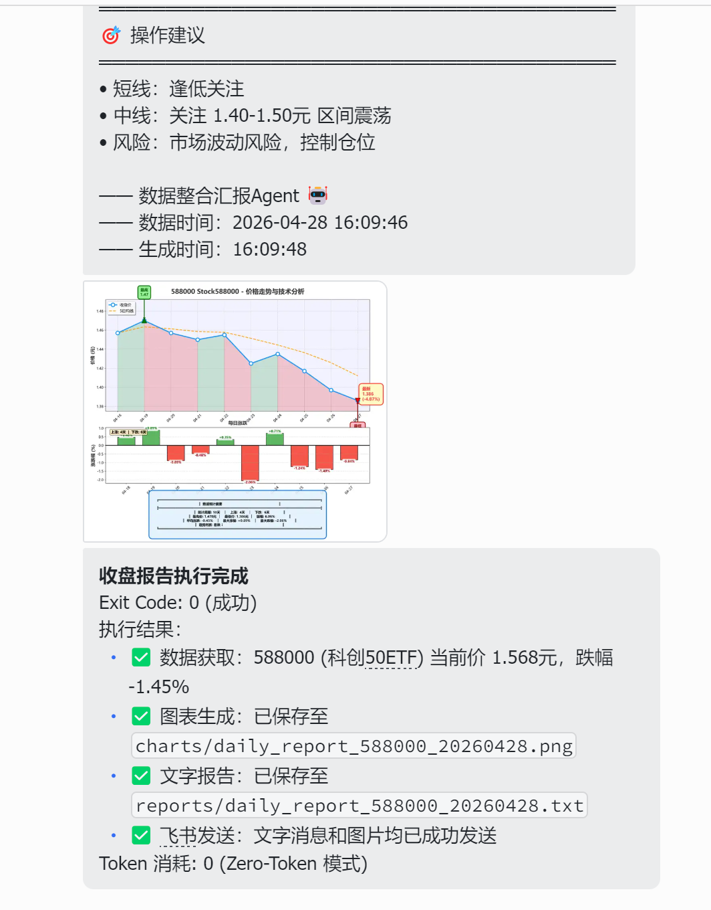
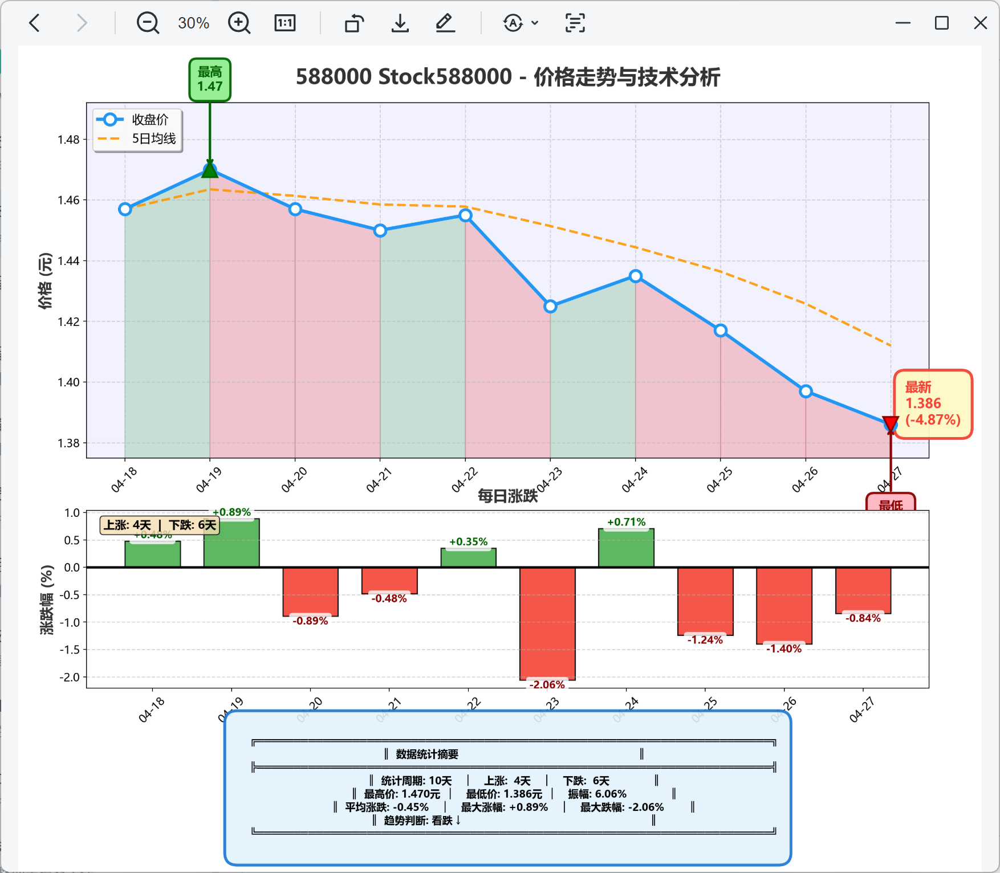
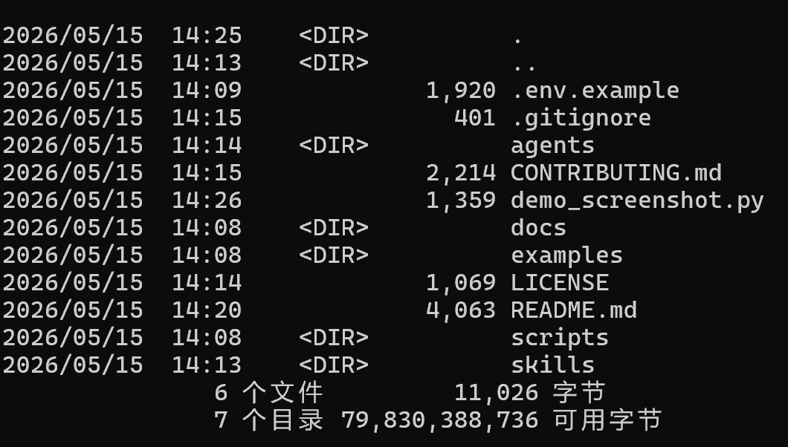
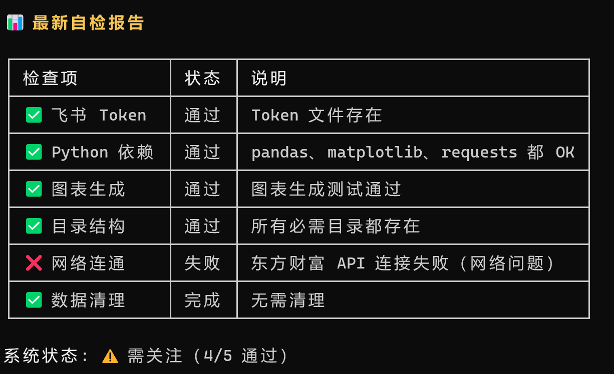

# OpenClaw Stock Assistant

> 基于 OpenClaw 的**零 Token 股票投资助手**  
> 自动抓取行情 → 技术指标分析 → 生成晨报 → 飞书推送，全程零 AI Token 消耗。

---

## 这是什么？

**一个纯 Python 驱动的股票晨报自动生成系统。**

不需要调用任何大模型 API，完全基于真实行情数据 + 传统技术指标（MA、RSI、MACD、布林带等），自动生成带可视化图表的每日晨报，推送到飞书。

- 输入：股票代码（如 `588000` 科创50ETF）
- 输出：数据摘要 + 技术指标解读 + 趋势判断 + 可视化图表
- 成本：**零 Token**，纯数据计算

**为什么做这个项目？**

市面上大多数"AI 投资助手"都依赖大模型生成分析，Token 成本高且容易"一本正经地胡说"。这个项目证明：**用数据和算法本身就能做出有价值的分析**，不需要每次都花钱问 AI。

---

## 核心特性

| 特性 | 说明 |
|------|------|
| **Zero-Token 设计** | 纯 Python 脚本驱动，不调用任何 LLM API，分析成本为零 |
| **多数据源容错** | 东方财富、腾讯财经双源采集，一个挂了自动切另一个 |
| **技术指标全覆盖** | MA（5/10/20/60日）、RSI、MACD、布林带、成交量分析 |
| **可视化图表** | 自动生成价格走势、涨跌幅、技术指标叠加图 |
| **飞书深度集成** | 支持文字 + 图片消息推送，群聊/私聊均可 |
| **自检修复系统** | 晨报发送前自动检查数据完整性，发现问题自动修复 |
| **定时自动化** | 支持 Cron 定时任务，每日开盘前自动推送晨报 |

---

## 技术决策

### 为什么不用大模型做分析？

| 维度 | 本项目（数据驱动） | 大模型方案 |
|------|------------------|-----------|
| 成本 | **零成本**，纯本地计算 | 每次分析消耗 Token，日均 0.5-2 元 |
| 稳定性 | 数据源稳定即稳定，不依赖第三方 AI 服务 | API 限速、服务中断直接影响功能 |
| 可解释性 | 每个结论都有明确的数据来源和计算公式 | 黑盒输出，可能"幻觉"编造数据 |
| 时效性 | 实时抓取最新行情，秒级响应 | 模型训练数据有 cutoff，对当日行情无感知 |
| 适用场景 | 固定格式的晨报生成、技术指标监控 | 开放式问答、深度研报撰写 |

**结论：** 晨报这种**结构化、数据密集型**任务，传统算法比大模型更靠谱、更便宜、更快。

---

## 系统架构

```
用户设定股票代码（如 588000）
        ↓
数据采集层
        ├── 东方财富 API → 实时行情 + 历史 K 线
        └── 腾讯财经 API（故障自动切换）
        ↓
指标计算层
        ├── MA（5/10/20/60日均线）
        ├── RSI（相对强弱指标）
        ├── MACD（异同移动平均线）
        ├── 布林带（Bollinger Bands）
        └── 成交量分析
        ↓
报告生成层
        ├── 数据摘要（开盘/收盘/最高/最低/成交量）
        ├── 技术指标解读（金叉/死叉/超买/超卖）
        ├── 趋势判断（短期/中期方向）
        └── 风险提示（波动率、异常信号）
        ↓
可视化层
        ├── 价格走势图（K线 + 均线叠加）
        └── 技术指标图（MACD/RSI/布林带）
        ↓
推送层
        ├── 飞书文字消息（数据摘要 + 分析结论）
        └── 飞书图片消息（图表附件）
```

---

## 运行截图

### 1. 飞书晨报推送效果



*飞书群聊收到的每日晨报，包含数据摘要 + 趋势判断 + 图表附件*

---

### 2. 自动生成的可视化图表



*价格走势 + 均线叠加 + 成交量柱状图，自动保存为图片*

---

### 3. 终端运行日志



*本地终端执行，数据采集 → 指标计算 → 图表生成 → 飞书推送，全流程可见*

---

### 4. 系统自检修复



*发送前自动检查数据完整性，发现缺失自动修复，确保晨报质量*

---

## 项目结构

```
openclaw-stock-assistant/          # 项目根目录
├── skills/                        # 核心功能脚本
│   ├── stock-daily-report.py     # 每日晨报生成（主入口）
│   ├── stock-system-maintenance.py  # 系统自检修复
│   └── stock-data-fetcher.py     # 数据采集器（东方财富/腾讯财经）
├── agents/                        # Agent 配置模板
│   └── stock-agent.yaml          # OpenClaw Agent 配置
├── screenshots/                   # 效果截图
├── examples/                      # 使用示例
├── .env.example                   # 环境变量模板（不含真实密钥）
├── README.md                      # 项目说明
└── requirements.txt               # Python 依赖
```

---

## 环境配置（详细版）

### 第一步：安装 Python

- 版本：**Python 3.10 或以上**
- 下载：https://www.python.org/downloads/
- 安装时勾选 **"Add Python to PATH"**

### 第二步：克隆仓库

```bash
git clone https://github.com/yourusername/openclaw-stock-assistant.git
cd openclaw-stock-assistant
```

### 第三步：安装依赖

```bash
pip install -r requirements.txt
```

**主要依赖说明：**

| 包名 | 用途 |
|------|------|
| `pandas` | 数据处理 + 指标计算 |
| `matplotlib` | 可视化图表生成 |
| `requests` | HTTP 数据采集 |

### 第四步：配置飞书

```bash
# 复制环境变量模板
cp .env.example .env

# 编辑 .env，填入你的飞书配置
```

**必须配置的环境变量：**

| 变量名 | 说明 | 获取方式 |
|--------|------|---------|
| `FEISHU_APP_ID` | 飞书应用 ID | 飞书开放平台 → 创建应用 |
| `FEISHU_APP_SECRET` | 飞书应用密钥 | 同上，应用凭证页面 |
| `FEISHU_CHAT_ID` | 飞书群聊 ID | 群设置 → 群信息 → 复制 Chat ID |

**可选配置：**

| 变量名 | 说明 | 默认值 |
|--------|------|--------|
| `DEFAULT_STOCK_CODE` | 默认股票代码 | `588000` |
| `WATCH_LIST` | 监控股票列表（逗号分隔） | 空 |

---

## 快速启动

### 生成晨报（不发送）

```bash
python skills/stock-daily-report.py --code 588000
```

### 生成晨报并推送到飞书

```bash
python skills/stock-daily-report.py --code 588000 --send
```

### 系统自检修复

```bash
python skills/stock-system-maintenance.py --fix
```

### 定时自动化（Cron 示例）

```bash
# 每日开盘前 9:00 自动生成并推送晨报
0 9 * * 1-5 cd /path/to/openclaw-stock-assistant && python skills/stock-daily-report.py --code 588000 --send
```

---

## 常见问题

### Q：数据源挂了怎么办？

**自动容错。** 系统内置东方财富 + 腾讯财经双源，一个挂了自动切另一个，无需手动干预。

### Q：可以监控多只股票吗？

可以。设置 `WATCH_LIST` 环境变量（如 `588000,000001,000858`），或每次执行时指定 `--code`。

### Q：图表是自动生成的吗？

是的。`matplotlib` 自动生成价格走势 + 技术指标叠加图，保存为 PNG 后随飞书消息推送。

### Q：需要 GPU 吗？

不需要。纯 CPU 计算，任何电脑都能跑。

---

## 未来规划

- **多周期分析**  
  支持日线、周线、月线多周期对比分析

- **预警系统**  
  价格突破布林带、RSI 超买超卖等异常信号自动告警

- **更多数据源**  
  接入雪球、同花顺等更多数据源，提高稳定性

- **回测框架**  
  基于历史数据验证技术指标策略的有效性

- **迁移到 Hermes Agent**  
  从 OpenClaw 迁移到 Hermes Agent 框架，统一管理多个 Skill

---

## 技术栈一览

| 层级 | 技术 |
|------|------|
| **数据采集** | requests + 东方财富/腾讯财经 API |
| **数据处理** | pandas |
| **技术指标** | 自研（MA / RSI / MACD / 布林带）|
| **可视化** | matplotlib |
| **消息推送** | 飞书 Open API |
| **定时任务** | Cron / 系统计划任务 |
| **Agent 框架** | OpenClaw（计划迁移到 Hermes Agent）|

---

## 开发者

**独立完成** — 从零到一，全程个人开发。

**开发者信息：**
- 🎓 深圳信息职业技术大学 · 工业互联网专业 · 大一
- 💻 全栈独立开发，正在考取**阿里云 ACA 认证**
- 📈 探索 AI + 金融数据的落地应用

> 如果你觉得这个项目有用，欢迎 Star ⭐ 和 Fork 🍴！
>
> 交流/合作请联系：911152066@qq.com / 2521673314@qq.com | 18718866016

---

## 许可证

MIT License — 自由使用、修改和分发。
